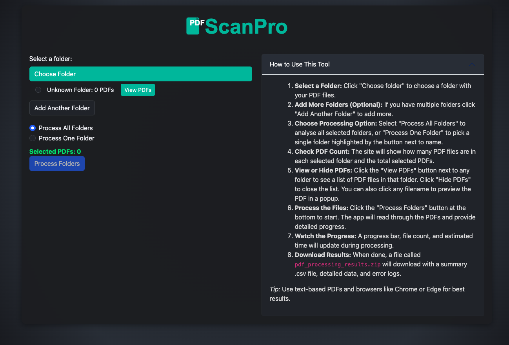
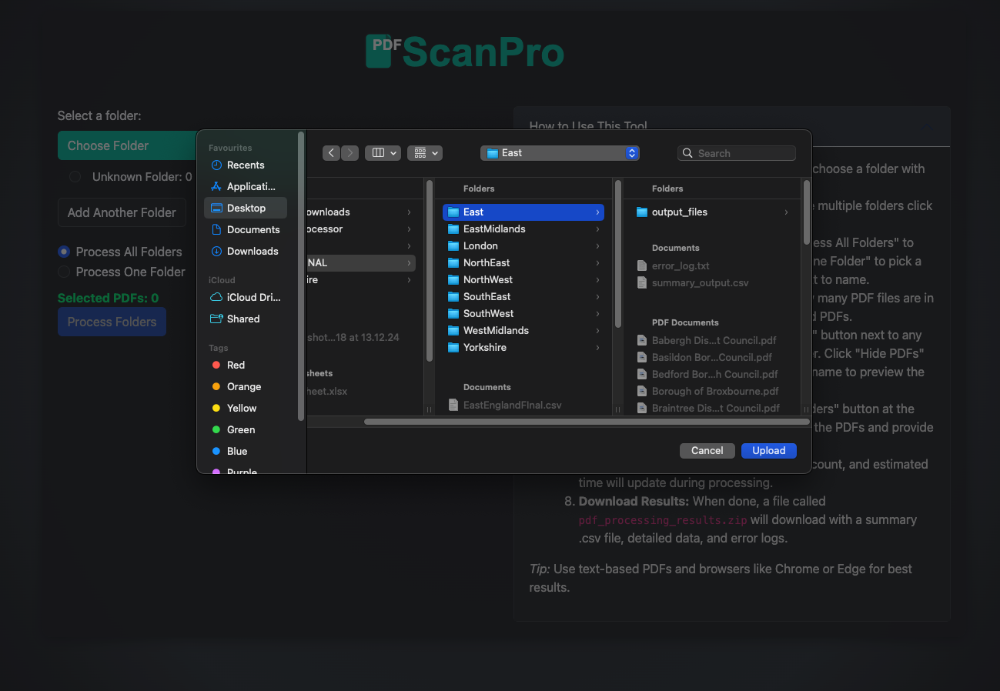
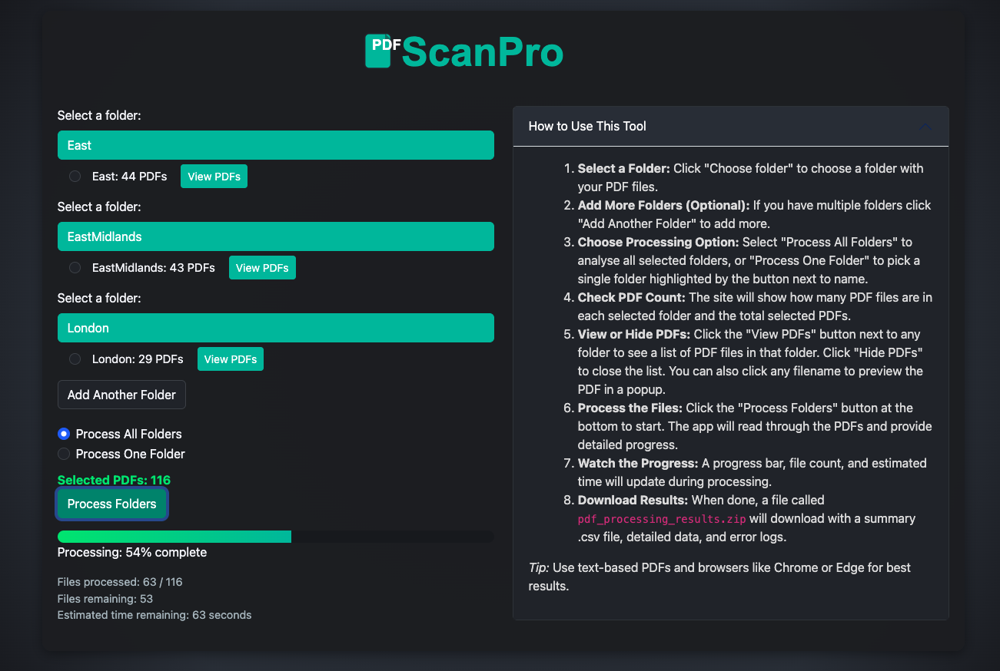

# Local Planning Authority PDF Analysis Tool

This tool automates the extraction of accessibility policy data from UK Local Planning Authority planning documents in PDF format. It is designed for researchers, analysts, and planners who need to batch-process large numbers of policy documents to extract standards such as M4(2) and M4(3), percentage targets, plan periods, and document adoption/proposal dates.

## Tool Overview

- **Batch PDF Processing:** Upload or specify a directory of PDFs for automated analysis.
- **Advanced Extraction:** Uses PyMuPDF, PyPDF2, and OCR (Tesseract) to extract text, even from scanned documents.
- **NLP Summarization:** Summarizes relevant policy text using LexRank (sumy) and NLTK.
- **Robust Pattern Matching:** Finds accessibility standards, percentages, and plan periods using regular expressions and context checks.
- **Multiprocessing:** Processes multiple PDFs in parallel for speed.
- **Comprehensive Output:** Generates CSV summaries, JSON details, and debug logs for transparency and troubleshooting.

## `Code With Notes.py` Description

`Code With Notes.py` is the main batch-processing script for extracting structured data from planning policy PDFs. Its core functionalities include:

- **Text Extraction:** Attempts to extract text from each PDF using PyMuPDF, falls back to PyPDF2, and finally OCR if needed.
- **Date Extraction:** Searches for adopted, proposed, draft, or general dates using regex patterns and context.
- **Standard & Percentage Detection:** Identifies mentions of M4(2) and M4(3) standards, and extracts associated percentage targets using multi-pass contextual checks.
- **Plan Period Extraction:** Finds plan periods (e.g., 2013–2032) using pattern matching.
- **Summarization:** Uses LexRank to summarize long policy sentences for concise reporting.
- **Debug Logging:** Writes detailed debug files for each PDF, including extraction steps and errors.
- **Parallel Processing:** Utilizes multiprocessing to handle large batches efficiently.
- **Output:** Produces a CSV summary, per-PDF JSON files, and error/debug logs in an output directory.

## How It Works

1. **User Input:** Specify a directory containing PDF files.
2. **Processing:** For each PDF, the script:
   - Extracts text (using PyMuPDF, PyPDF2, or OCR).
   - Searches for relevant standards, percentages, plan periods, and dates.
   - Summarizes and logs findings.
3. **Output:** Results are saved as:
   - `summary_output.csv` — Main summary table.
   - `summary_*.json` — Detailed extraction per PDF.
   - `date_debug_*.txt` and `extracted_text_*.txt` — Debug logs.
   - `error_log.txt` — Any errors encountered.
  
## Technologies Used

- **Python 3** — Main programming language for scripting and automation.
- **PyMuPDF (fitz)** — PDF text extraction and parsing.
- **PyPDF2** — Alternative PDF text extraction library.
- **pdf2image** — Converts PDF pages to images for OCR.
- **pytesseract** — Optical Character Recognition (OCR) for scanned PDFs.
- **Pillow (PIL)** — Image processing and enhancement.
- **sumy** — Text summarization using LexRank.
- **nltk** — Natural Language Toolkit for tokenization and NLP tasks.
- **tqdm** — Progress bars for batch processing.
- **multiprocessing** — Parallel processing for faster PDF analysis.
- **csv, json, re, pathlib, os, shutil, tempfile, zipfile, threading** — Python standard libraries for file handling, regex, and utilities.

**Install dependencies:**

```bash
pip install PyMuPDF PyPDF2 pdf2image pytesseract Pillow sumy nltk tqdm multiprocessing-logging
```

## File Structure

- `Code With Notes.py` — Main batch-processing script.

---

*This tool streamlines the extraction of accessibility policy data from UK planning documents, supporting research, compliance, and policy analysis.*

# Local Planning Authority PDF Analysis Web Tool

## Screenshots

### Main Upload Interface


### Selecting Folders


### Processing Extraction and Results


This project provides a web-based tool for batch-processing UK Local Planning Authority planning policy PDF documents. It extracts key accessibility standards (M4(2), M4(3)), percentage targets, plan periods, and document adoption/proposal dates. The tool uses advanced PDF parsing, OCR, and NLP techniques to automate data extraction and summarization.

## Features

- **Batch PDF Upload:** Upload multiple PDFs via a simple web interface.
- **Automated Extraction:** Extracts M4(2) and M4(3) accessibility standards, percentage targets, plan periods, and document dates.
- **OCR Support:** Uses Tesseract OCR for scanned PDFs.
- **Summarization:** Summarizes relevant text using NLP (LexRank).
- **Progress Tracking:** Real-time progress updates during processing.
- **Downloadable Results:** Outputs results as CSV, JSON, and debug logs in a ZIP file.
- **Error Logging:** Detailed error logs for troubleshooting.
- **Multiprocessing:** Fast processing of large batches.

## Technologies Used

- **Python 3** — Main programming language.
- **Flask** — Web framework for building the upload and results interface.
- **PyMuPDF (fitz)** — PDF text extraction and parsing.
- **PyPDF2** — Alternative PDF text extraction.
- **pdf2image** — Converts PDF pages to images for OCR.
- **Pillow (PIL)** — Image processing and enhancement.
- **sumy** — Text summarization using LexRank.
- **nltk** — Natural Language Toolkit for tokenization and NLP tasks.
- **tqdm** — Progress bars for batch processing.
- **multiprocessing, threading** — Parallel and threaded processing for efficiency.
- **csv, json, re, pathlib, os, shutil, tempfile, zipfile** — Python standard libraries for file handling, regex, and utilities.
- **HTML5** — Markup language for structuring the web interface.
- **CSS3** — Custom styles and layout, including dark mode and responsive design.
- **Bootstrap 5** — CSS framework for layout, components, and modals.
- **JavaScript (ES6+)** — Handles folder selection, file upload, PDF preview, progress tracking, and dynamic UI updates.
- **Fetch API** — For asynchronous communication with the Flask backend.

## Usage

1. **Install dependencies:**
   ```bash
   pip install flask PyMuPDF PyPDF2 pdf2image Pillow sumy nltk tqdm
   ```

2. **Run the app:**
   ```bash
   python app.py
   ```

3. **Open your browser:**  
   Go to `your local host` http://127.0.0.1:5000/ (Press CTRL+C in Terminal to quit)

4. **Upload PDFs:**  
   Use the web interface to upload one or more PDF files.

5. **Download results:**  
   After processing, download the ZIP file containing CSV, JSON, and debug logs.


## File Structure

- `app.py` — Main Flask application and processing logic.
- `templates/index.html` — Web interface for uploading PDFs.


## Example Output

- `summary_output.csv` — Table of extracted data.
- `summary_*.json` — Detailed extraction per PDF.
- `error_log.txt` — Processing errors and debug info.

*This web tool is designed to help automate the extraction of accessibility policy data from UK planning documents for research and analysis.*
